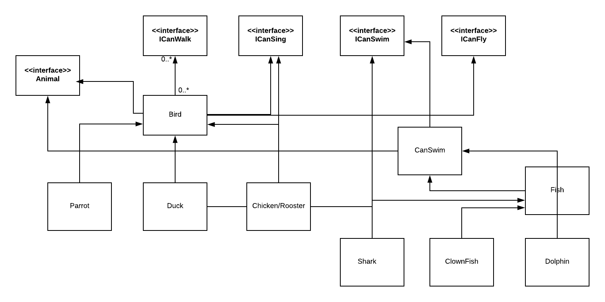

# singtelAssignment

In this repository you will find spring boot based java application catering to model the different behaviors of Animal
with inheriting the common traits between them and exposing the same with REST API

1) We have divided the different behaviors of Animal in multiple interfaces with Animal interface being implemented by all concrete classes
2) Interfaces :
   * Animal - empty interface
   * ICanFly - fly()
   * ICanWalk - walk()
   * ICanSing - sing()
   * ICanSwim - swim()
   
 3) Concrete classes :
    Bird.java -> implementing Animal, ICanFly, ICanSing, ICanWalk interfaces
    Duck.java -> extends Bird.java and implements ICanSwim
    Chicken.java -> extends Bird.java and implements ICanSing
    (Note : Chicken.java works for both chicken and Rooster type object, for Rooster need to create parameterised object)
    Parrot.java -> extends Bird.java
    (Note : Parrot.java works for all three types of Parrot, need to create parameterised object)
    
    CanSwim.java -> implements ICanSwim , Animal
    Fish.java -> extends CanSwim.java
    Dolphin.java -> extends CanSwim.java
    Shark.java and ClownFish.java -> extends Fish.java
    
    
    RESTFul service created in AnimalController.java
    
    
   

How to run this application 

1) Go to Application.java and run it as java application => go to browser and type http://localhost:8080/animals
2) In AnimalService.java, in order to change the type of Parrot and sound of Rooster, need to change the ENUM value inside
static block.

High Level UML Diagram :

